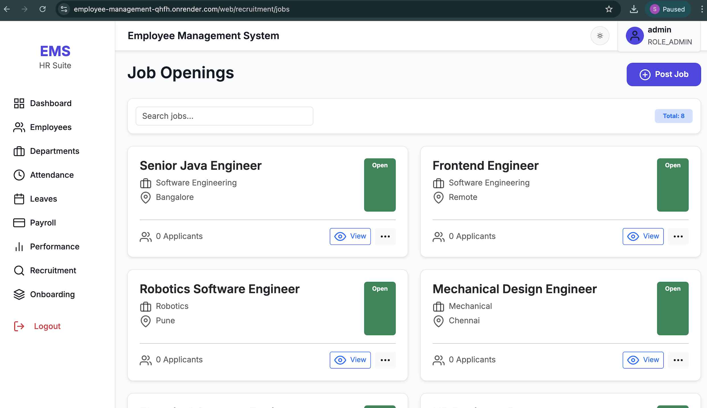
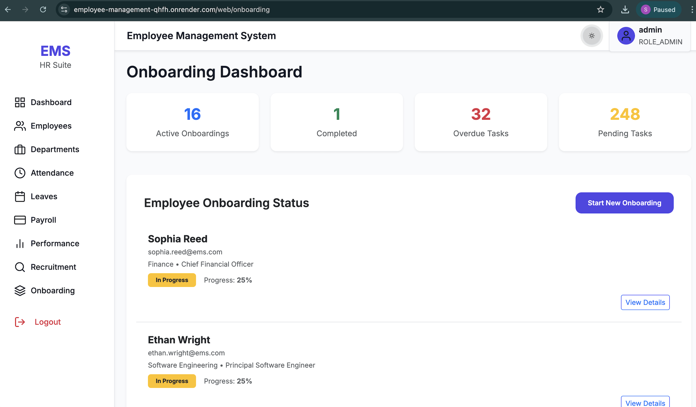
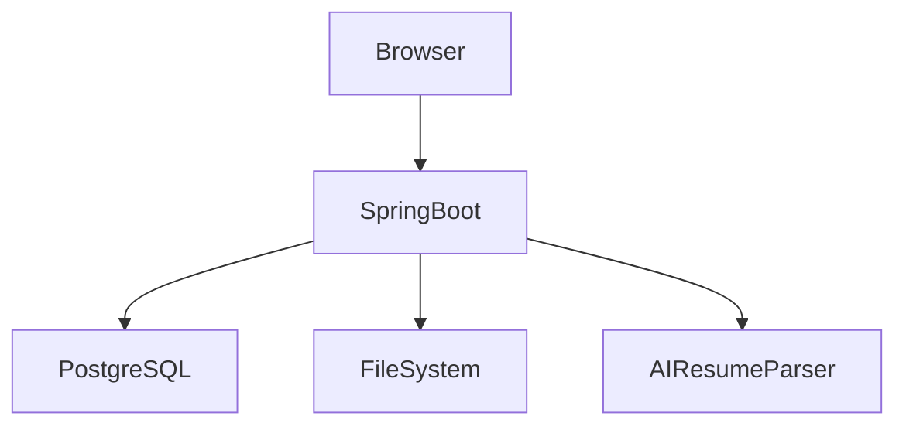

# 🚀 Employee Management System (EMS)


A **production-grade, AI-powered Employee Management System** built with **Spring Boot**, designed to handle the **entire employee lifecycle** — from recruitment and onboarding to payroll, attendance, performance reviews, and analytics.

🌐 **Live Deployment**:  
👉 https://employee-management-qhfh.onrender.com

---

## 📌 Table of Contents
- Overview
- User Roles
- Key Features
- Screenshots
- Architecture
- Tech Stack
- Project Structure
- API Documentation
- Docker & Deployment
- CI/CD Pipeline
- Security
- License

---

## 🧠 Overview

The Employee Management System (EMS) is a **full-stack enterprise HR platform** with:
- AI-based resume parsing & scoring
- End-to-end recruitment pipeline
- Role-based access control
- Analytics dashboards
- Automated document generation (PDF, Excel)
- Production-ready Docker & CI/CD setup

It is suitable for **real-world corporate HR workflows**.

---

## 👥 User Roles

### 👑 Admin
- Manage departments & employees
- Assign roles
- System-wide analytics
- Payroll & KPI control

### 🧑‍💼 HR
- Post jobs & manage recruitment
- AI resume scoring & shortlisting
- Schedule interviews
- Generate offer letters
- Manage onboarding

### 👨‍💻 Employee
- Attendance check-in/out
- Apply for leave
- View payroll & performance reviews
- Complete onboarding tasks

---

## ✨ Key Features

### 🔍 Recruitment & AI
- Resume PDF parsing (Apache PDFBox)
- AI skill extraction & experience detection
- Resume-to-job matching score
- Smart shortlisting dashboard

### 📋 Employee Management
- CRUD employees & departments
- Active / inactive lifecycle
- Secure role-based access

### ⏱ Attendance & Leave
- Daily attendance tracking
- Leave balances & analytics
- Excel & PDF exports

### 📈 Performance & KPI
- Self & manager reviews
- KPI assignment & scoring
- Review cycles (Q1, H1, Yearly)

### 💰 Payroll
- Monthly payroll generation
- Allowances & deductions
- Export payroll reports

### 🚀 Onboarding
- Template-based onboarding flows
- Task assignments & document uploads
- Completion tracking

---

## 🖼 Screenshots

> Screenshots are stored under `docs/screenshots/`

### Dashboard


### Recruitment & AI Scoring


### Job Openings


### Attendance


### Payroll


### Onboarding


---

## 📐 Architecture

### High-Level Architecture (Mermaid)



### Components
- **Spring Boot MVC** – Controllers, Services, Repositories
- **Spring Security** – Role-based authentication
- **Neon PostgreSQL** – Cloud-native database
- **Docker** – Containerized runtime
- **GitHub Actions** – CI/CD

---

## 🛠 Tech Stack

| Layer | Technology |
|-----|-----------|
| Backend | Java 17/21, Spring Boot |
| Security | Spring Security |
| Database | PostgreSQL (Neon) |
| ORM | Hibernate / JPA |
| Templating | Thymeleaf |
| Build | Maven |
| CI/CD | GitHub Actions |
| Container | Docker, Docker Compose |
| Cloud | Render |

---

## 📂 Project Structure

```text
employee-management/
├── src/main/java/com/empmgmt
│   ├── model
│   ├── repository
│   ├── service
│   ├── service/impl
│   ├── security
│   └── util
├── src/main/resources
│   ├── templates
│   ├── static
│   └── application-*.properties
├── docs/screenshots
├── Dockerfile
├── docker-compose.yml
├── docker-compose.prod.yml
├── docker-compose.test.yml
├── api.md
└── README.md
```

---

## 📡 API Documentation

Complete REST API documentation is available here:  
👉 **[api.md](api.md)**

Includes:
- Authentication
- Recruitment APIs
- Employee, Leave, Payroll endpoints
- Admin & HR-only routes

---

## 🐳 Docker & Deployment

### Development
```bash
docker-compose up --build
```

### Production
```bash
docker-compose -f docker-compose.prod.yml up -d
```

### Testing
```bash
docker-compose -f docker-compose.test.yml up --build
```

---

## 🔁 CI/CD Pipeline (GitHub Actions)

This project includes a **robust CI pipeline**:

- Triggered on:
  - Push to `main`
  - Pull Requests
  - Manual dispatch

- Matrix build:
  - Java 17
  - Java 21

### CI Workflow Highlights
- Maven dependency caching
- Parallel Java builds
- Test execution
- Artifact uploads (JARs)
- JUnit test reporting
- Failure logs upload

Workflow file:
```text
.github/workflows/ci.yml
```

---

## 🔐 Security

- Spring Security with role-based authorization
- BCrypt password hashing
- Route-level access control
- CSRF protection
- Secure file uploads

---

## 📜 License

This project is licensed under the **MIT License**.  
See the [LICENSE](LICENSE) file for details.

---

## ⭐ Final Note

This project is **enterprise-grade**, production-ready, and showcases:
- Clean architecture
- Real-world HR workflows
- AI integration
- DevOps best practices

If you like this project, **give it a star ⭐**!
