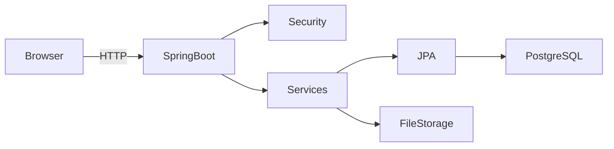
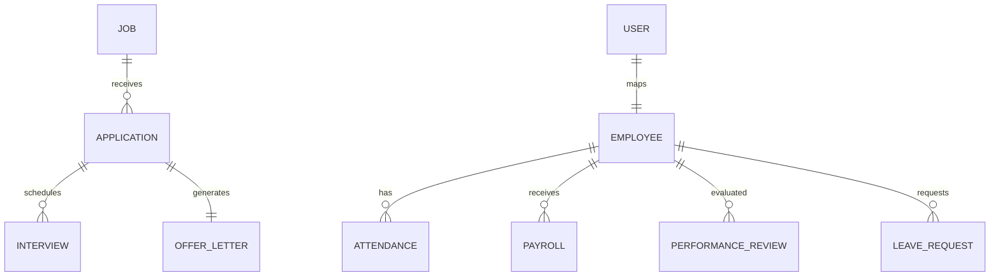

# 🏢 Employee Management System (EMS)


**Live Demo:** https://employee-management-qhfh.onrender.com

---

## 🚀 Overview

A **production-grade, full‑stack Employee Management System** built with **Spring Boot 4**, **Thymeleaf**, and **PostgreSQL (Neon)**.  
It covers the **entire employee lifecycle** — from recruitment → onboarding → attendance → payroll → performance → analytics.

Designed with **clean architecture**, **role-based security**, **CI/CD**, and **cloud deployment**.

---

## 🧩 What Problems This Solves (Resume‑Ready)

✔ Replaces spreadsheets with a **single source of truth**  
✔ Automates **recruitment + AI resume scoring**  
✔ Enforces **secure role-based workflows (Admin / HR / Employee)**  
✔ Provides **real-time dashboards & analytics**  
✔ Handles **enterprise concerns**: auditing, CI/CD, Docker, env separation  
✔ Scales cleanly from **local → cloud (Render + Neon)**

> 💼 **Impact:** Demonstrates real-world HRMS architecture & production readiness.

---

## 👥 User Roles

| Role | Capabilities |
|-----|-------------|
| **Admin** | Full system control, analytics, payroll, performance |
| **HR** | Recruitment, onboarding, leave approval, interviews |
| **Employee** | Attendance, leave requests, payroll, self reviews |

---

## 🎬 Animated Walkthroughs

> Place GIFs under `docs/gifs/`

| Feature | Demo |
|------|------|
| Dashboard |  |
| Recruitment Pipeline |  |
| Payroll Flow |  |
| Performance Reviews |  |

---

## 🖼️ Screenshots

| Dashboard | Recruitment |
|---------|------------|
|  |  |

| Payroll | Attendance |
|--------|------------|
|  |  |

---

## 📐 System Architecture



### Architecture Highlights
- MVC + Service + Repository
- Spring Security (RBAC)
- JPA + Hibernate
- Flyway (Dev)
- Dockerized runtime

---

## 🗄️ ER Diagram (Database Schema)



---

## 📡 API Documentation

### Authentication
```http
POST /login
Content-Type: application/x-www-form-urlencoded

username=admin&password=employee123
```

### Employees
```http
GET /web/employees?page=0&size=10
```

### Apply for Job
```http
POST /careers/apply/{jobId}
FormData:
- name
- email
- phone
- resume (PDF)
```

### Attendance
```http
POST /web/attendance/clock-in
POST /web/attendance/clock-out
```

### Payroll
```http
POST /web/payroll/generate
```

📘 Full OpenAPI:
- `/swagger-ui.html`
- `/v3/api-docs`

---

## 🐳 Docker Setup

### Development
```bash
docker-compose up --build
```

### Production
```bash
docker-compose -f docker-compose.prod.yml up -d
```

---

## ⚙️ Environment Profiles

| Profile | DB | Usage |
|------|----|------|
| dev | H2 | Local |
| prod | Neon PostgreSQL | Render |

---

## 🔄 CI/CD Pipeline

- GitHub Actions
- Java 17 & 21 matrix
- Maven cache
- Artifact upload
- JUnit reporting

```text
.github/workflows/ci.yml
```

---

## 📂 Monorepo‑Grade Docs Index

```text
docs/
├── screenshots/     # UI screenshots
├── gifs/            # Animated walkthroughs
├── api.md           # Extended API reference
├── architecture.md  # System design
├── database.md      # Schema notes
```

---

## 🔐 Security

- Spring Security 6
- BCrypt hashing
- CSRF protection
- Role‑based access control
- Auditing via `AuditorAware`

---

## 📦 Tech Stack

- Java 17 / 21
- Spring Boot 4
- Spring Security
- Thymeleaf
- PostgreSQL (Neon)
- Docker & Docker Compose
- GitHub Actions

---

## 📜 License

MIT License © 2025

---

## ⭐ Star This Repo

If this project helped you or inspired you, please ⭐ star it!
