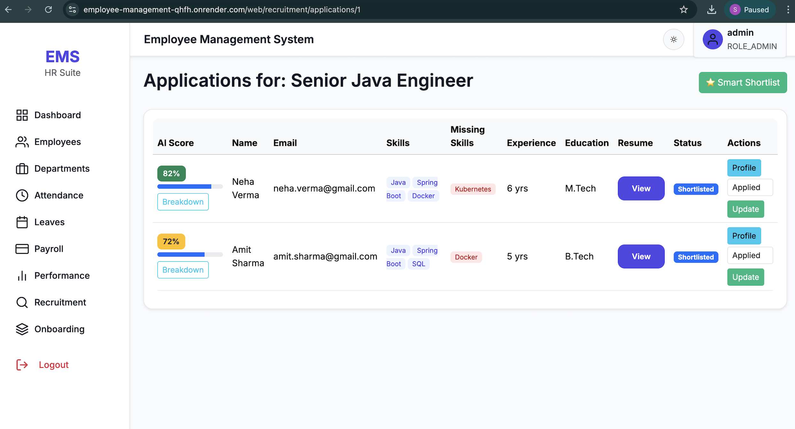
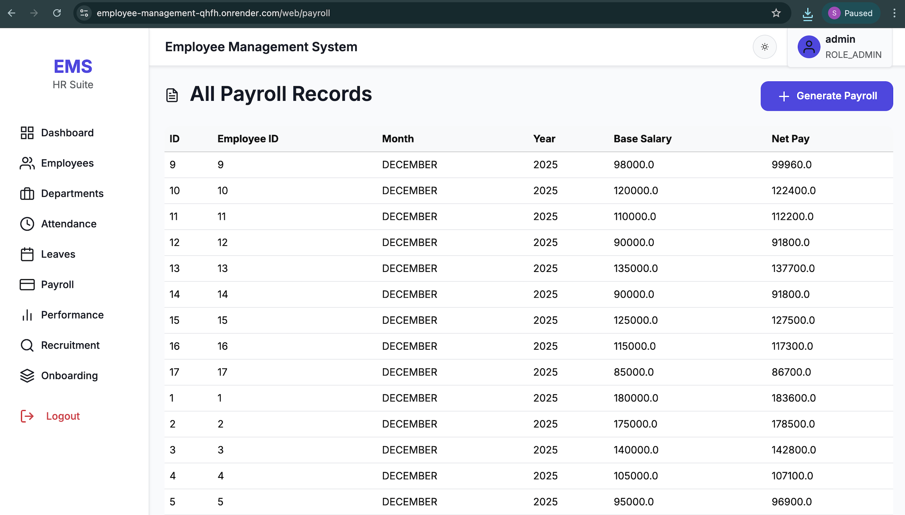
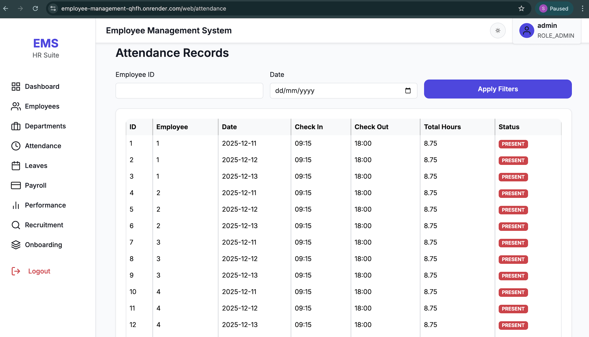
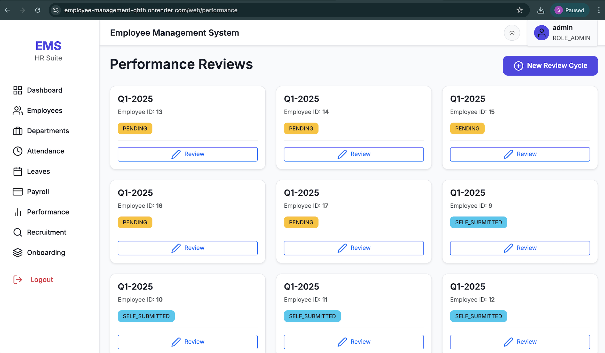
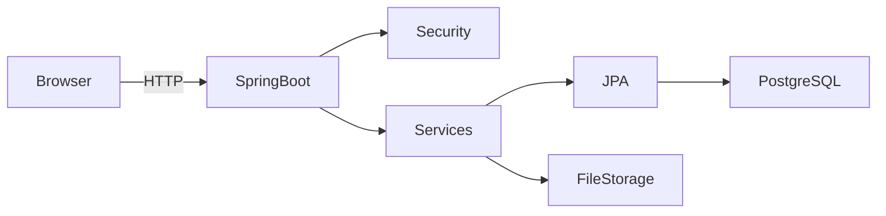
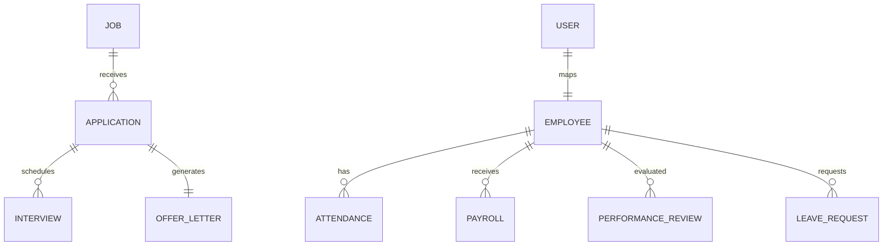

# 🚀 Employee Management System (EMS)


A ** Employee Management System** built with **Spring Boot, Thymeleaf, Spring Security, PostgreSQL (Neon)** and deployed on **Render**.  
This system covers the **complete employee lifecycle** — from recruitment and onboarding to payroll, performance reviews, and analytics.

🌐 **Live Deployment**: https://employee-management-qhfh.onrender.com

---

## 📌 Table of Contents
- [Overview](#overview)
- [User Roles](#user-roles)
- [Key Features](#key-features)
- [Screenshots](#screenshots)
- [Architecture](#architecture)
- [Technology Stack](#technology-stack)
- [Project Structure](#project-structure)
- [Security](#security)
- [API Documentation](#api-documentation)
- [Docker & Deployment](#docker--deployment)
- [CI/CD Pipeline](#cicd-pipeline)
- [Environment Configuration](#environment-configuration)
- [Running Locally](#running-locally)
- [License](#license)

---

## 🧠 Overview

The **Employee Management System (EMS)** is designed as a **real‑world HRMS platform**.

It supports:
- Secure role‑based access
- AI‑assisted recruitment scoring
- End‑to‑end employee lifecycle management
- Real analytics dashboards
- Production‑grade DevOps & CI/CD

---

## 👥 User Roles

| Role | Capabilities |
|-----|-------------|
| **Admin** | Full system access, users, departments, payroll, analytics |
| **HR** | Recruitment, onboarding, attendance, performance, leave |
| **Employee** | Self‑service: attendance, payroll, leave, performance |

---

## ✨ Key Features

### 🧑‍💼 Employee Management
- Create, update, soft‑delete & restore employees
- Department & role management
- Search, filter & pagination

### 🧠 Recruitment & AI Scoring
- Job postings & public careers page
- Resume upload & parsing (PDF)
- AI resume scoring & missing skills detection
- Smart shortlisting
- Interview scheduling
- Offer letter PDF generation
- Convert hired candidates → employees
- Automatic onboarding trigger

### 🧾 Attendance & Leave
- Clock‑in / clock‑out
- Attendance analytics
- Leave application & approval workflow
- Leave balance tracking
- Calendar & reports (PDF / Excel)

### 💰 Payroll
- Monthly payroll generation
- Salary breakdown
- Mark payroll as paid
- Employee self‑view

### 📊 Performance Management
- Review cycles (Q1, H1, Yearly)
- Self review & manager review
- Final score calculation

### 🚀 Onboarding
- Template‑based onboarding flows
- Task assignment & tracking
- File uploads

### 📈 Dashboards & Analytics
- Employee growth trends
- Salary distribution
- Department analytics
- Recruitment funnel insights

---

## 🖼 Screenshots

> Screenshots are stored under `docs/screenshots/`

| Module | Preview |
|------|--------|
| Dashboard |  |
| Recruitment |  |
| Candidate Profile |  |
| Payroll |  |
| Attendance |  |
| Performance Review |  |

---

## 📐 System Architecture



### Architecture Highlights
- MVC + Service + Repository
- Spring Security (RBAC)
- JPA + Hibernate
- Flyway (Dev)
- Dockerized runtime

---

## 🗄️ ER Diagram (Database Schema)



---

## 🛠 Technology Stack

| Layer | Technology |
|-----|-----------|
| Backend | Java 17/21, Spring Boot |
| Security | Spring Security, BCrypt |
| Frontend | Thymeleaf, HTML, CSS |
| Database | PostgreSQL (Neon), H2 (dev) |
| ORM | Spring Data JPA |
| AI | Custom Resume Parsing & Scoring |
| Build | Maven |
| DevOps | Docker, Docker Compose |
| CI/CD | GitHub Actions |
| Hosting | Render |

---

## 🗂 Project Structure

```text

src/main/java/com/empmgmt
├── controller
├── service
│   └── impl
├── repository
├── model
├── security
├── util
└── config

```

Resources:

```text

src/main/resources
├── templates
├── static/css
├── application.properties
├── application-dev.properties
└── application-prod.properties

```

---

## 🔐 Security

- Spring Security form‑based authentication
- Role‑based authorization
- CSRF protection (Cookie‑based)
- Password hashing with BCrypt
- Secure file uploads
- Auditing (createdBy / updatedBy)

---

## 📘 API Documentation

- Swagger UI: `/swagger-ui.html`
- OpenAPI JSON: `/v3/api-docs`
- Detailed REST documentation: **[api.md](api.md)**

---

## 🐳 Docker & Deployment

### Dockerfile
Multi‑stage build:
- Maven build stage
- Lightweight JRE runtime stage

### Docker Compose Files
| File | Purpose |
|----|--------|
| docker-compose.yml | Local development |
| docker-compose.prod.yml | Production |
| docker-compose.test.yml | CI / testing |

---

## 🔁 CI/CD Pipeline

GitHub Actions:
- Java 17 & 21 matrix builds
- Maven build & package
- Artifact upload
- Fully green & production‑safe

Workflow file:
```
.github/workflows/ci.yml
```

---

## 📂 Monorepo‑Grade Docs Index

```text

docs/
├── screenshots/     # UI screenshots
├── api.md           # Extended API reference
├── architecture.md  # System design
├── database.md      # Schema notes

```

---

## ⚙️ Environment Configuration

`.env.example`
```env
SPRING_DATASOURCE_URL=jdbc:postgresql://...
SPRING_DATASOURCE_USERNAME=postgres
SPRING_DATASOURCE_PASSWORD=secret
SPRING_PROFILES_ACTIVE=prod
```

##  Environment Profiles

| Profile | DB | Usage |
|------|----|------|
| dev | H2 | Local |
| prod | Neon PostgreSQL | Render |

---

## ▶️ Running Locally

### Option 1: Maven

```bash
mvn clean package
java -jar target/employee-management-2.0.0.jar
```

### Option 2: Docker

```bash
docker-compose up --build
```

App runs at:

```
http://localhost:8080
```

---

## 📄 License

MIT License © 2025 

---

If you like this project, please ⭐ the repository!
