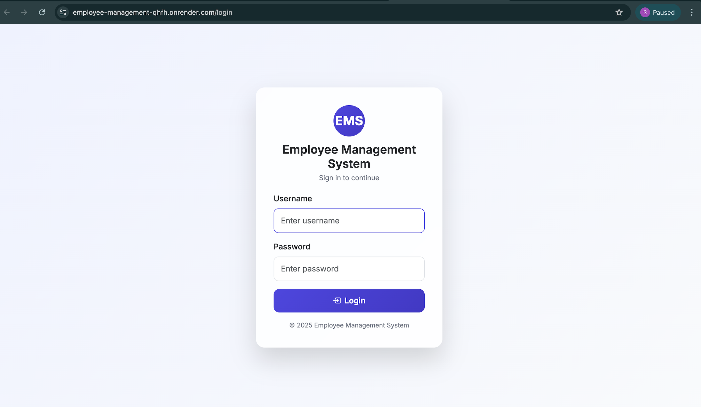
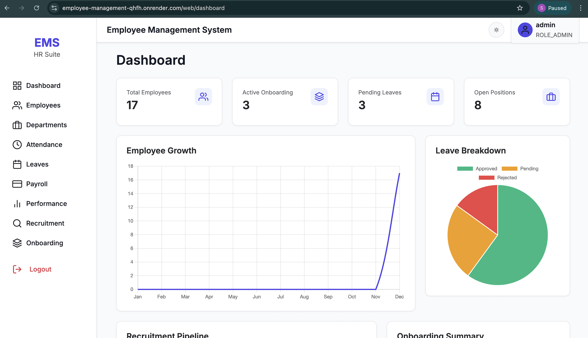
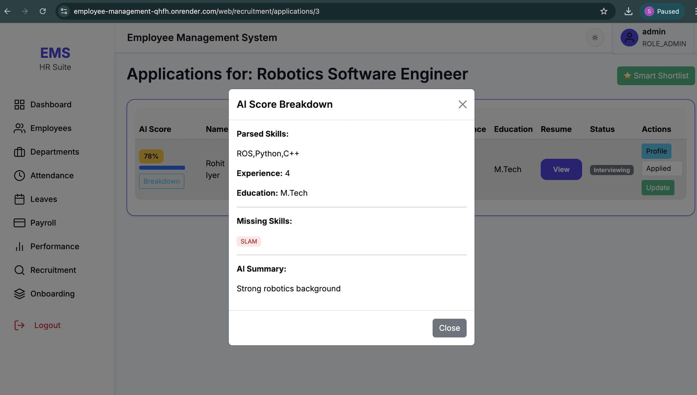
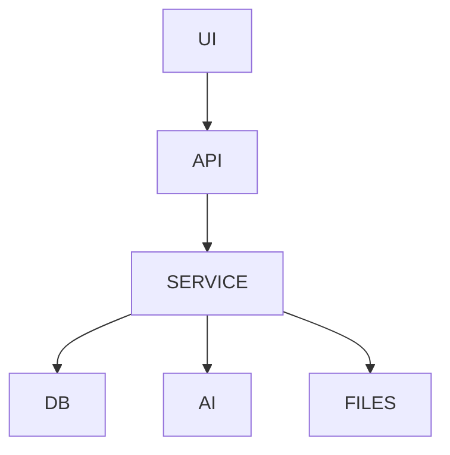

# 🏢 Employee Management System (EMS)

[](https://adoptium.net/)
[](https://spring.io/projects/spring-boot)
[](https://neon.tech)
[](https://www.docker.com/)
[](https://github.com/TheComputationalCore/employee-management/actions)
[](LICENSE)

**Live Deployment:** 🌐 https://employee-management-qhfh.onrender.com

---

## 📌 Overview

The **Employee Management System (EMS)** is a **production-grade, enterprise-ready HRMS platform** built using **Spring Boot**, **PostgreSQL (Neon)**, **Docker**, and **Thymeleaf**.

It covers the **entire employee lifecycle**, from recruitment and AI-powered resume screening to onboarding, attendance, payroll, leave management, KPIs, and performance reviews — all with **role-based access control**.

---

## 👥 User Roles & Access Control

| Role | Capabilities |
|----|----|
| **Admin** | Full system access, analytics, payroll |
| **HR** | Recruitment, interviews, performance |
| **Employee** | Attendance, leave, payroll, reviews |

---

## ✨ Core Features

- 🔐 Secure Authentication (Spring Security + BCrypt)
- 🧠 AI Resume Parsing & Scoring
- 📊 Analytics Dashboards
- 👔 Employee Lifecycle Management
- 🌴 Leave & Attendance Tracking
- 🚀 Onboarding Automation
- 💰 Payroll Processing
- 📈 KPI & Performance Reviews

---

## 📸 Screenshots





---

## 📐 Architecture



---

## 🐳 Docker

```bash
docker-compose up --build
```

---

## 📚 API Docs

See **api.md**

---

## 🚀 Deployment

**Live URL:** https://employee-management-qhfh.onrender.com

---

## 📜 License

MIT License
