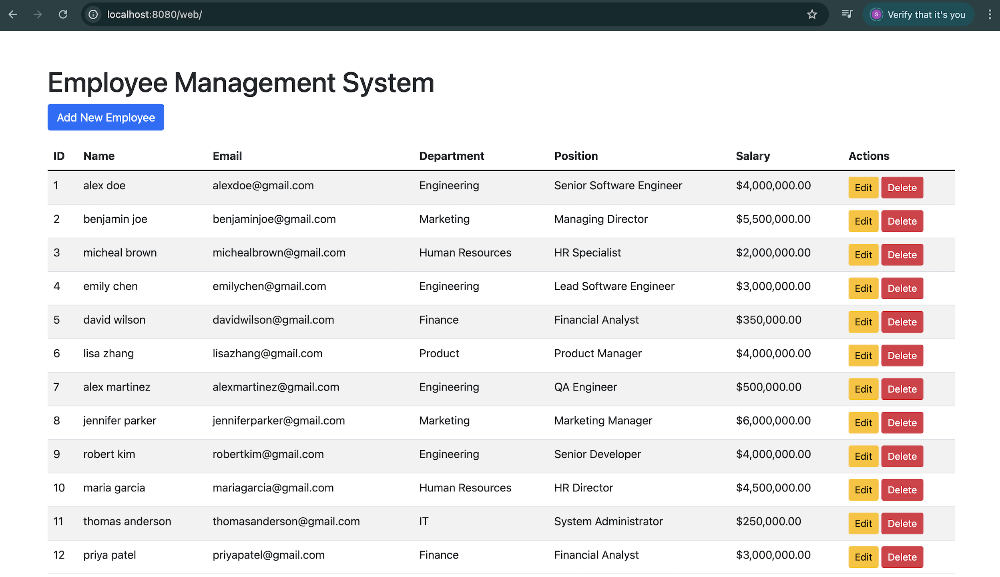
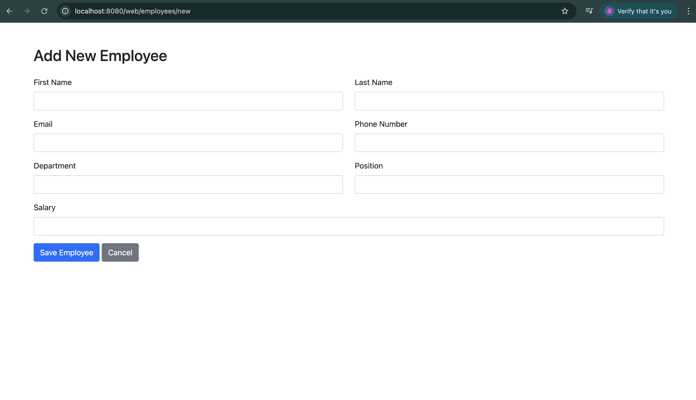
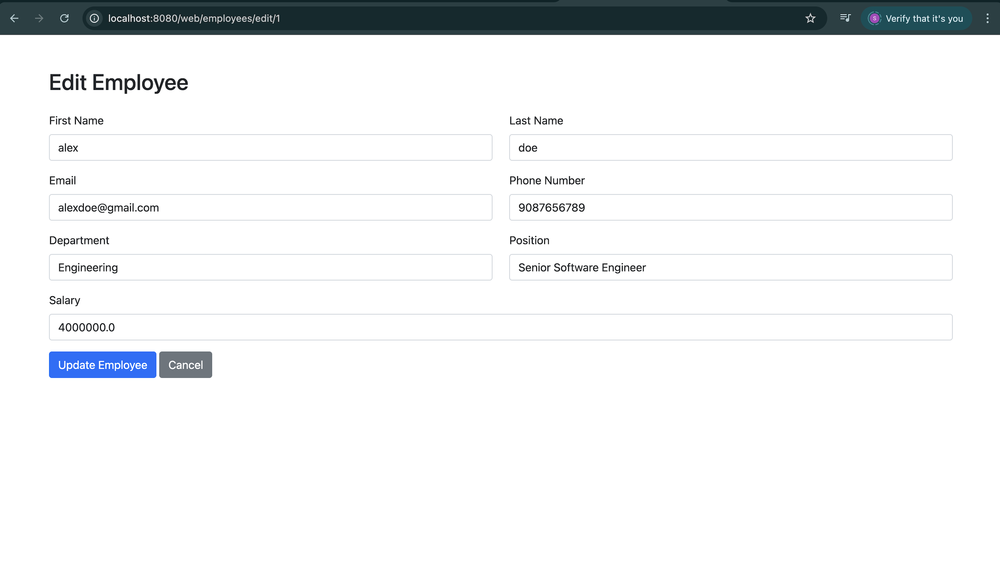
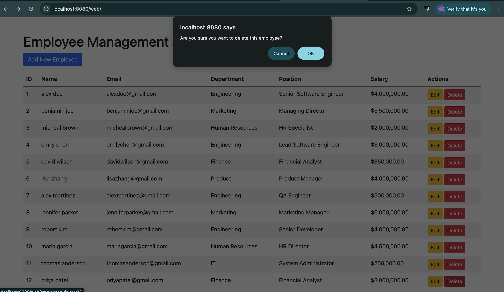
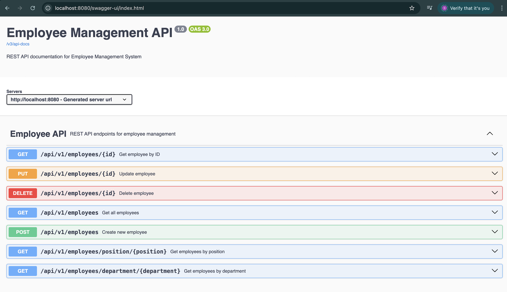
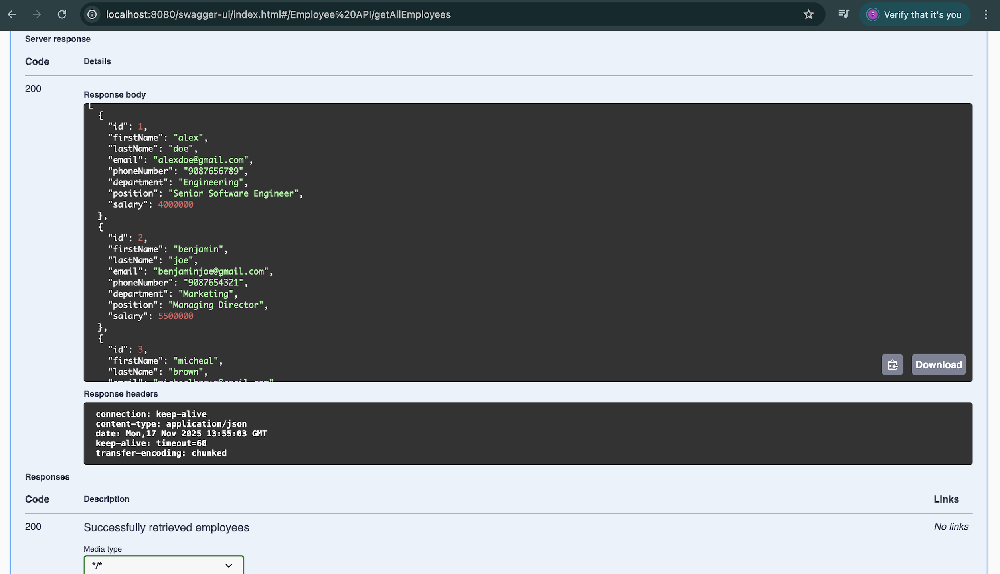
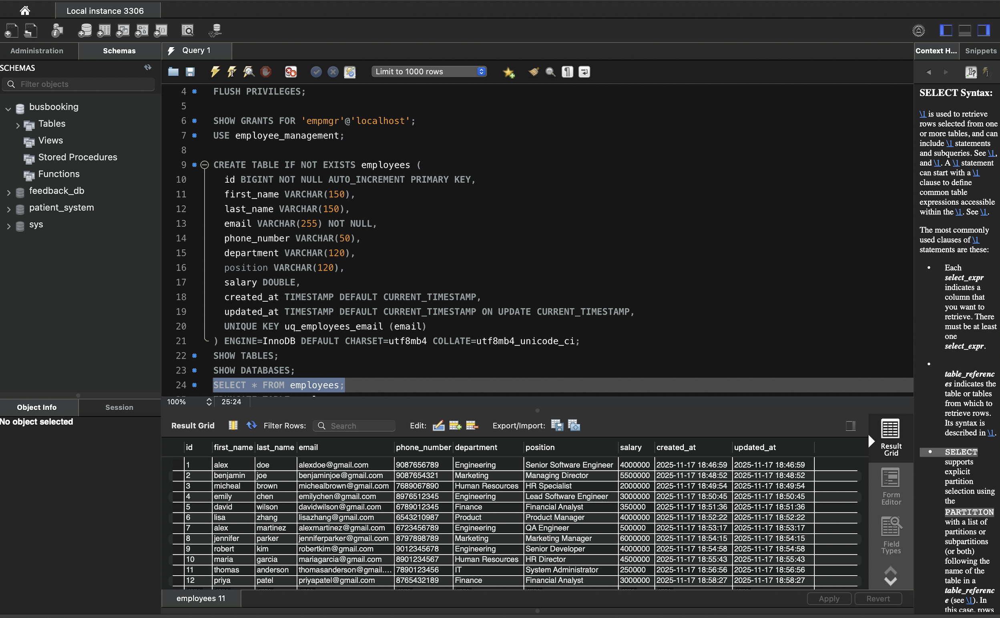

# 🚀 Employee Management System

A complete Employee Management System built with **Spring Boot 3**, **Spring Data JPA**, **Thymeleaf**, **Bootstrap 5**, and **MySQL**.  
Supports full CRUD operations, validation, REST APIs, and Swagger documentation.  
Perfect as a portfolio project for full-stack Java & backend engineering roles.

---

## 🎥 Demo (Short Walkthrough)

📺 **YouTube Demo:**  
https://youtu.be/TXTjFwRVCm0

---

## 🔥 Highlights

- ✔️ Full CRUD — Create / Read / Update / Delete employees  
- ✔️ Responsive UI using Bootstrap 5  
- ✔️ REST API endpoints (JSON)  
- ✔️ Swagger/OpenAPI documentation  
- ✔️ Form validation (server + client)  
- ✔️ MySQL database with Spring Data JPA  
- ✔️ Clean MVC + service-layer architecture  

---

## 🧩 Tech Stack

| Layer | Technology |
|------|------------|
| Backend | Spring Boot 3, Spring Data JPA |
| Frontend | Thymeleaf, Bootstrap 5, jQuery |
| Database | MySQL |
| Build Tool | Maven |
| API Docs | Swagger / OpenAPI 3 |

---

## 📁 Project Structure

```
employee-management/
├── src/
│   ├── main/java/.../controller
│   ├── main/java/.../service
│   ├── main/java/.../repository
│   ├── main/java/.../model
│   └── main/resources/
│       ├── templates/
│       └── static/
├── docs/
│   └── screenshots/
└── README.md
```

---

## ⚙️ Quickstart

### 1️⃣ Clone the Repository
```bash
git clone https://github.com/TheComputationalCore/employee-management.git
cd employee-management
```

### 2️⃣ Create MySQL Database
```sql
CREATE DATABASE employee_management;
```

### 3️⃣ Configure Database Credentials  
Edit:

```
src/main/resources/application.properties
```

### 4️⃣ Build & Run
```bash
mvn clean install
mvn spring-boot:run
```

### 5️⃣ Access the Application

| Feature | URL |
|---------|-----|
| 🌐 Web UI | http://localhost:8080/web |
| 📘 Swagger Docs | http://localhost:8080/swagger-ui/index.html |

---

## 📄 REST API Summary

| Method | Endpoint | Description |
|--------|----------|-------------|
| GET | `/api/v1/employees` | Get all employees |
| GET | `/api/v1/employees/{id}` | Get employee by ID |
| POST | `/api/v1/employees` | Create employee |
| PUT | `/api/v1/employees/{id}` | Update employee |
| DELETE | `/api/v1/employees/{id}` | Delete employee |
| GET | `/api/v1/employees/department/{department}` | Filter by department |
| GET | `/api/v1/employees/position/{position}` | Filter by position |

---

## 🧬 Employee Model

```
id (Long)
firstName (String)
lastName (String)
email (String, unique)
phoneNumber (String)
department (String)
position (String)
salary (Double)
```

---

# 📸 Screenshots

All screenshots are stored in:

```
docs/screenshots/
```

### 🖥️ Dashboard (Employee List)


### ➕ Add Employee


### ✏️ Edit Employee


### 🗑️ Delete Employee Confirmation


### 📘 API Documentation (Swagger UI)


### 🔍 API Testing (GET Employees)


### 🛢️ MySQL Table Data


---

## 🚀 Future Improvements

- Pagination, search & filtering  
- Role-based authentication (Spring Security)  
- Unit + integration tests  
- GitHub Actions CI pipeline  
- Deployment (Railway / AWS / Azure)  

---

## 🤝 Contributing

See **CONTRIBUTING.md** for contribution rules.

---

## 📜 License

Licensed under the **MIT License** — see `LICENSE`.

---

## ✉️ Contact

**Dinesh Chandra — TheComputationalCore**  
- GitHub: https://github.com/TheComputationalCore  
- YouTube: https://www.youtube.com/@TheComputationalCore  
