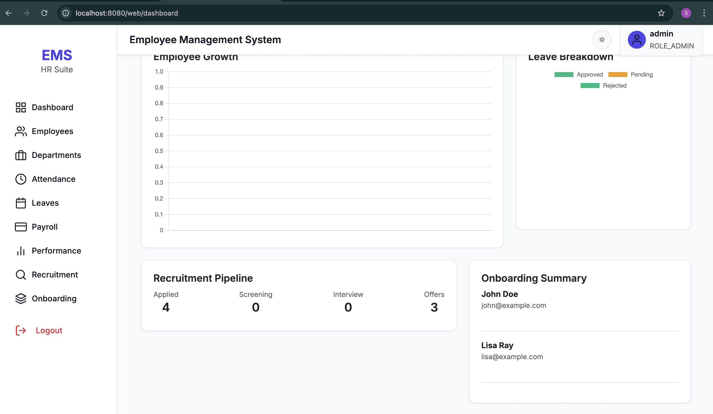
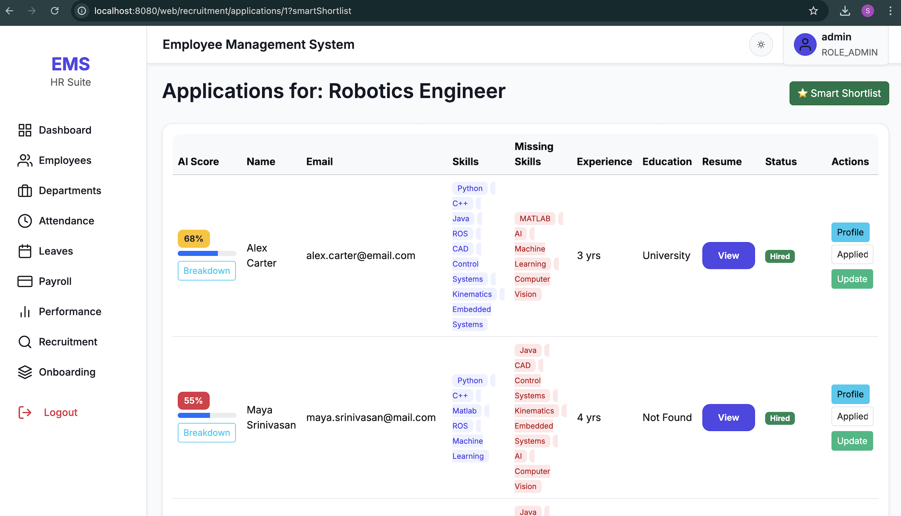
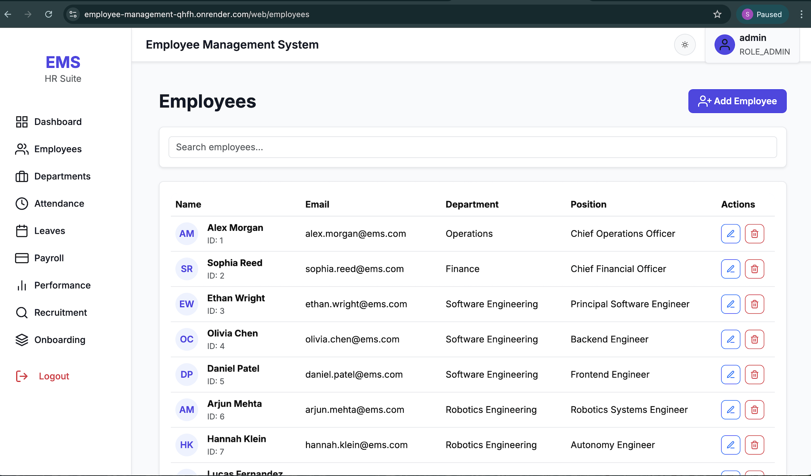
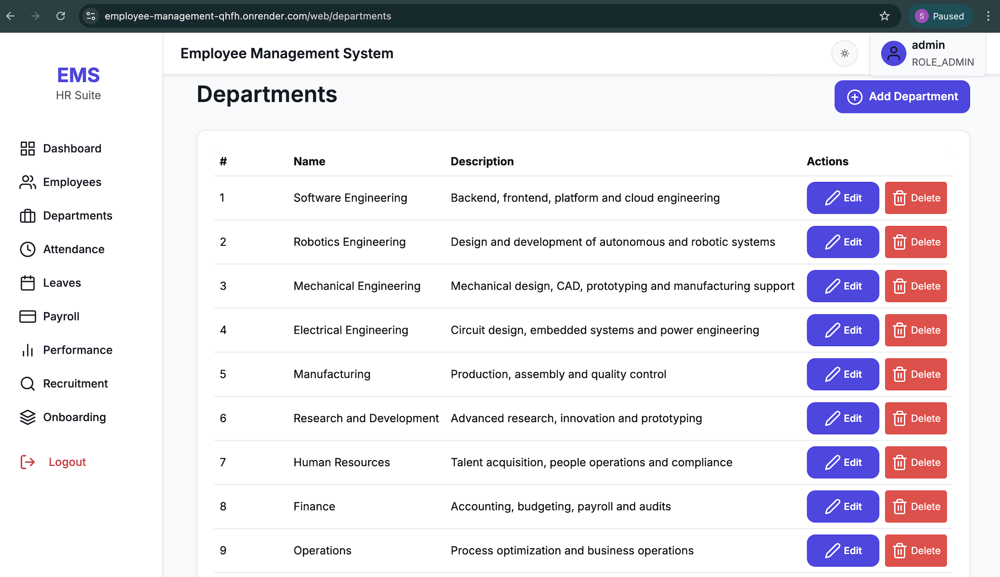
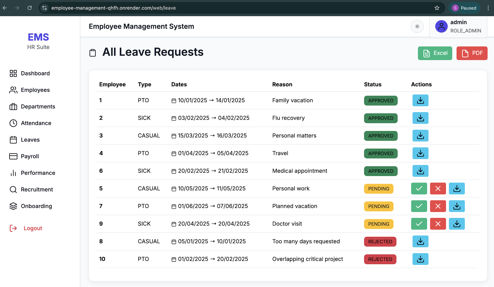
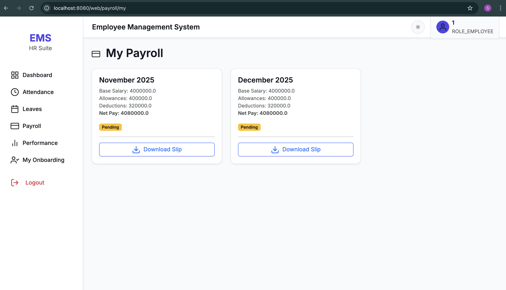
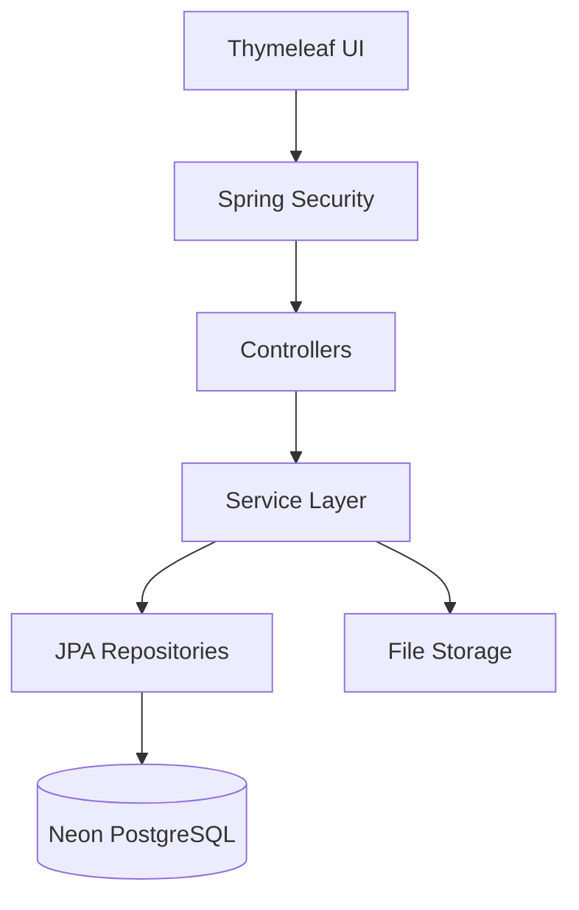

# 🚀 Employee Management System (EMS)


> **Enterprise‑grade Employee Management System** with Recruitment, HR, Payroll, Performance, Attendance, Leave, Onboarding and AI‑assisted Resume Screening — built using **Spring Boot + Thymeleaf + Neon PostgreSQL**.

---

## 📌 Table of Contents

- [Overview](#-overview)
- [Key Features](#-key-features)
- [User Roles](#-user-roles)
- [Screenshots](#-screenshots)
- [Architecture](#-architecture)
- [Tech Stack](#-tech-stack)
- [Project Structure](#-project-structure)
- [Database](#-database)
- [Security](#-security)
- [API Documentation](#-api-documentation)
- [Setup & Installation](#-setup--installation)
- [Environment Variables](#-environment-variables)
- [CI/CD & Workflows](#-cicd--workflows)
- [Deployment](#-deployment)
- [Future Enhancements](#-future-enhancements)
- [License](#-license)

---

## 🔍 Overview

The **Employee Management System (EMS)** is a full‑stack, production‑ready HR platform designed to handle:

- End‑to‑end recruitment lifecycle
- Employee operations
- Performance & KPI management
- Payroll and attendance
- Leave workflows
- Secure role‑based access
- AI‑powered resume parsing & scoring

This project reflects **real‑world enterprise design patterns** with modular services, layered architecture, and scalable database design.

---

## ✨ Key Features

### 👥 Employee Management
- Create, update, deactivate employees
- Department & role assignment
- Secure user linkage

### 📄 Recruitment & Hiring
- Job postings & careers portal
- Resume upload (PDF)
- AI‑based resume parsing & scoring
- Shortlisting & interview scheduling
- Offer letter PDF generation

### 🤖 AI Resume Analysis
- Skill extraction
- Experience detection
- Missing skill gap analysis
- AI score (0–100)

### 🕒 Attendance
- Check‑in / check‑out
- Daily attendance records
- Status: Present / Absent / Half‑day

### 🏖 Leave Management
- Apply & approve leave
- Leave balance tracking
- Analytics dashboard
- Excel & PDF exports

### 💰 Payroll
- Monthly payroll generation
- Deductions & allowances
- Net salary computation
- Employee payroll view

### 📈 Performance & KPIs
- Self & manager reviews
- KPI assignment
- Weighted scoring
- Review lifecycle tracking

### 🧩 Onboarding
- Onboarding flows
- Task templates
- File uploads
- Completion tracking

---

## 👤 User Roles

| Role | Capabilities |
|----|----|
| **ADMIN** | Full system access, configuration |
| **HR** | Recruitment, onboarding, payroll, performance |
| **EMPLOYEE** | Attendance, leave, payroll, self‑reviews |

---

## 🖼 Screenshots

### Dashboard



### Recruitment & AI




### Employees & HR



### Attendance & Leave



### Payroll & Performance



---

## 📐 Architecture

### High‑Level Architecture (Mermaid)



### Layered Design

- **Controller** → Request handling
- **Service** → Business logic
- **Repository** → Data access
- **Entity** → Domain model

---

## 🛠 Tech Stack

- **Backend**: Java 17, Spring Boot 3
- **Frontend**: Thymeleaf, HTML, CSS
- **Security**: Spring Security, BCrypt
- **Database**: Neon PostgreSQL, H2 (dev)
- **ORM**: Spring Data JPA / Hibernate
- **Build**: Maven
- **CI/CD**: GitHub Actions
- **Docs**: Swagger OpenAPI

---

## 🗂 Project Structure

```text
employee-management/
├── src/main/java/com/empmgmt
│   ├── security
│   ├── model
│   ├── repository
│   ├── service
│   └── util
├── src/main/resources
│   ├── templates
│   ├── static
│   └── application*.properties
├── docs/screenshots
├── .github/workflows
├── Dockerfile
└── pom.xml
```

---

## 🗄 Database

- **Production**: Neon PostgreSQL
- **Dev**: H2 In‑Memory
- **Schema Management**:
  - Dev → Flyway enabled
  - Prod → Hibernate `ddl-auto=update`

---

## 🔐 Security

- Spring Security form‑login
- Role‑based authorization
- CSRF protection (cookie‑based)
- BCrypt password encoding

---

## 📘 API Documentation

Swagger UI available at:

```
/swagger-ui.html
```

OpenAPI JSON:

```
/v3/api-docs
```

> Full API reference can be added under `/docs/api.md`

---

## ⚙ Setup & Installation

```bash
git clone https://github.com/TheComputationalCore/employee-management.git
cd employee-management
mvn clean install
mvn spring-boot:run
```

---

## 🔑 Environment Variables

```env
SPRING_PROFILES_ACTIVE=prod
SPRING_DATASOURCE_URL=
SPRING_DATASOURCE_USERNAME=
SPRING_DATASOURCE_PASSWORD=
PORT=8080
```

---

## 🔄 CI/CD & Workflows

- **ci.yml** → Build & test
- **codeql-analysis.yml** → Security scanning
- **dependabot.yml** → Dependency updates

---

## 🚀 Deployment

- Docker‑ready
- Compatible with **Render**, **Railway**, **AWS**, **GCP**
- Single JAR runtime

---

## 🧠 Future Enhancements

- JWT‑based REST APIs
- Microservices split
- React frontend
- Advanced AI resume scoring
- Audit logs

---

## 📄 License

This project is licensed under the **MIT License**.

---

### ⭐ If you like this project, give it a star!
