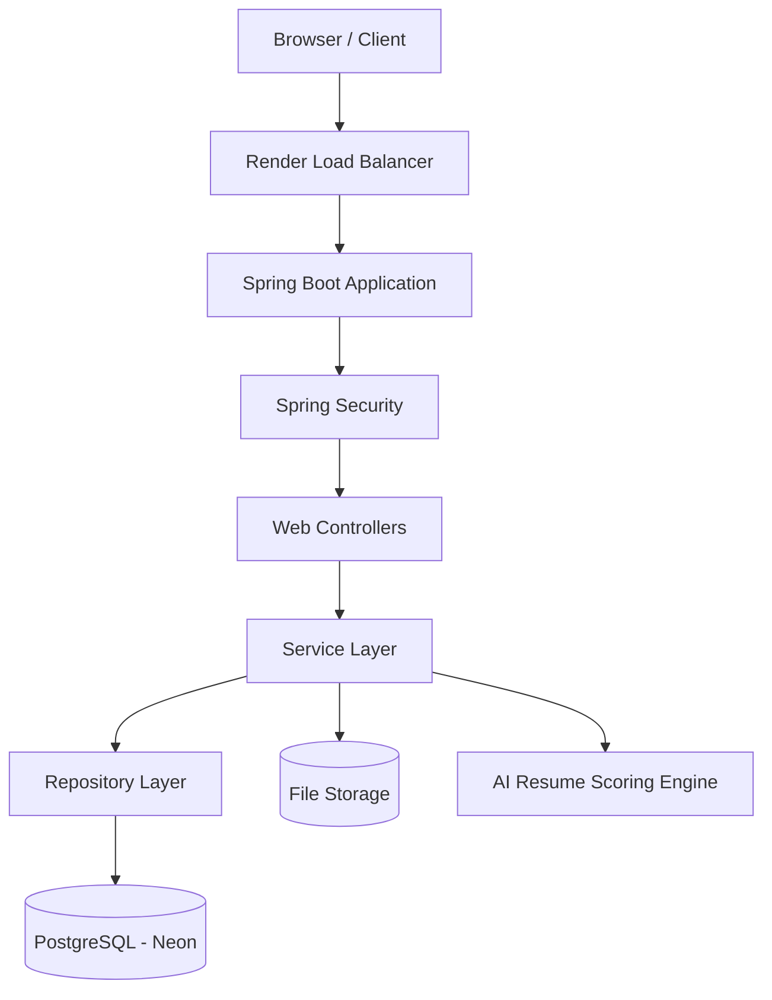
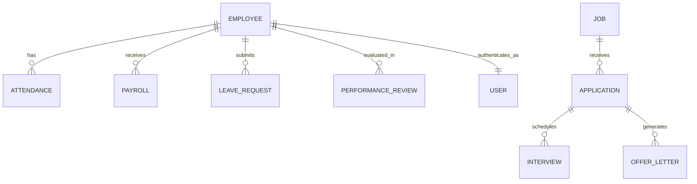
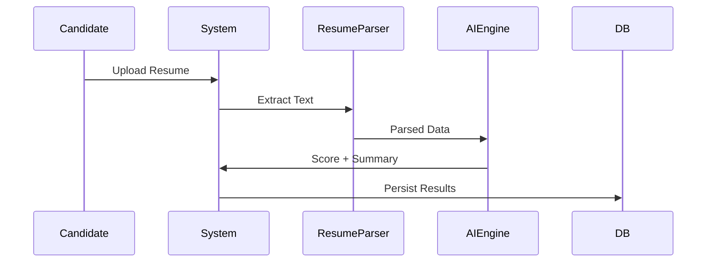
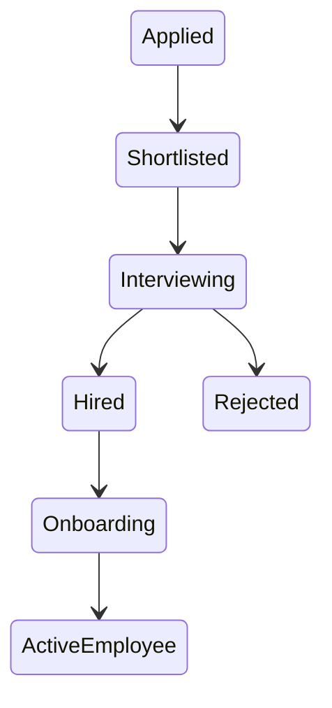
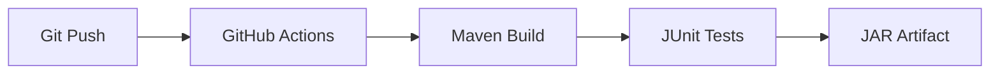
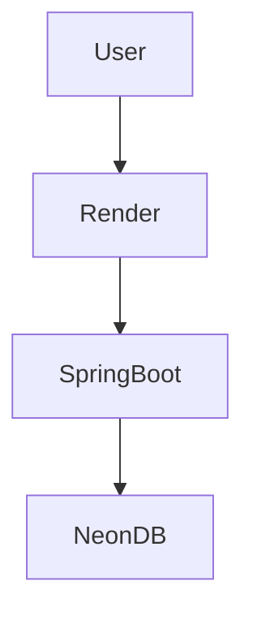

# 🏗️ System Architecture — Employee Management Platform

This document provides a **deep, production-grade architectural overview** of the Employee Management System (EMS).  
It explains **how the system is designed**, **why certain decisions were made**, and **how components interact** — suitable for **senior engineers, reviewers, and interview discussions**.

---

## 1️⃣ High-Level Architecture

The system follows a **layered, modular monolithic architecture** with clear separation of concerns.



### Key Characteristics
- **Monolithic but modular** (scales well for startups & mid-size orgs)
- **Stateless backend** (session via Spring Security)
- **Cloud-native ready**
- **Strong domain separation**

---

## 2️⃣ Architectural Layers Explained

### 🔐 Security Layer
- **Spring Security 6**
- Form-based authentication
- Role-based access control:
  - `ROLE_ADMIN`
  - `ROLE_HR`
  - `ROLE_EMPLOYEE`
- CSRF protection enabled
- Passwords encrypted using **BCrypt**

```text
SecurityConfig
 └── AuthenticationProvider (DAO)
 └── CustomUserDetailsService
 └── Role-based route protection
```

---

### 🌐 Web Layer (Controllers)
Handles **HTTP requests**, view rendering, and validation.

Responsibilities:
- Request routing
- Input validation
- Role-based access control
- Model preparation for Thymeleaf

Examples:
- `EmployeeWebController`
- `RecruitmentController`
- `PayrollWebController`
- `PerformanceWebController`

> Controllers never contain business logic — they delegate to services.

---

### 🧠 Service Layer (Business Logic)

This is the **heart of the application**.

Responsibilities:
- Enforces business rules
- Coordinates multiple repositories
- Orchestrates workflows
- Handles transactions

Examples:
- `EmployeeServiceImpl`
- `RecruitmentServiceImpl`
- `PayrollServiceImpl`
- `PerformanceServiceImpl`
- `OnboardingServiceImpl`

```text
Controller
  ↓
Service (Transactional)
  ↓
Repository
```

✔ Each service is:
- Unit-testable
- Stateless
- Focused on a single domain

---

### 🗄️ Repository Layer (Data Access)

Implemented using **Spring Data JPA**.

Responsibilities:
- Abstract database access
- Custom queries for analytics & search
- Pagination & sorting

Examples:
- `EmployeeRepository`
- `ApplicationRepository`
- `AttendanceRepository`
- `PayrollRepository`

Database:
- **PostgreSQL (Neon)** in production
- **H2 (in-memory)** for development

---

## 3️⃣ Database Architecture

### Key Design Principles
- Normalized schema
- Audit fields via `BaseEntity`
- Soft deletes (Employee)
- Enum-driven states



---

## 4️⃣ File Storage Architecture

Files are **stored outside the database** for scalability.

```text
uploads/
 ├── resumes/
 ├── offers/
 └── onboarding/
```

Usage:
- Resume uploads
- Offer letter PDFs
- Onboarding documents

✔ Stored paths are persisted in DB  
✔ Secure access via controller-level checks

---

## 5️⃣ AI Resume Scoring Engine

A lightweight, explainable AI engine.

### Inputs
- Resume text (PDF parsing)
- Job required skills
- Experience & education

### Outputs
- AI Score (0–100)
- Missing skills
- Human-readable summary



✔ Transparent scoring (no black box)
✔ Deterministic & auditable

---

## 6️⃣ Workflow Architecture (End-to-End)

### Recruitment → Employee Lifecycle



Once hired:
- Employee record auto-created
- User account generated
- Onboarding flow initiated

---

## 7️⃣ CI/CD Architecture

### Continuous Integration
- GitHub Actions
- Java 17 & 21 matrix
- Maven build & test
- Artifact uploads



---

## 8️⃣ Deployment Architecture

### Production Stack
- **Render** — App hosting
- **Neon PostgreSQL** — Managed DB
- **Docker** — Containerized builds



Environment separation:
- `dev` → H2 + seed data
- `prod` → PostgreSQL (Neon)

---

## 9️⃣ Scalability & Future Enhancements

Designed to scale into:
- Microservices (if needed)
- Event-driven workflows
- External AI services
- Object storage (S3-compatible)

Planned upgrades:
- Redis caching
- Async job processing
- OAuth2 / SSO
- GraphQL API layer

---

## 🔚 Summary

This architecture:
- Is **production-ready**
- Balances simplicity with power
- Demonstrates **real-world engineering maturity**
- Is ideal for **enterprise-grade HR platforms**

> This document can be confidently used in **technical interviews, system design rounds, and portfolio reviews**.
