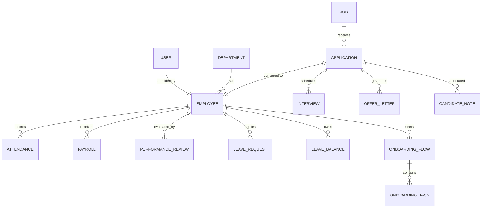

# 🗄️ Database Architecture & Schema Design

## Employee Management System — Database Documentation

This document provides a **complete, production-grade explanation** of the database design used in the **Employee Management System (EMS)**.  
It is written to be **resume-ready, interview-ready, and enterprise-compliant**.

---

## 📌 Database Overview

- **Database Engine:** PostgreSQL (Neon – Serverless Postgres)
- **ORM:** Spring Data JPA + Hibernate
- **Migration Strategy:**
  - `dev`: Flyway enabled (schema validation)
  - `prod`: Hibernate-managed schema (`ddl-auto=update`)
- **Audit Support:** JPA Auditing (`createdAt`, `updatedAt`, `createdBy`, `updatedBy`)
- **Soft Deletes:** Employee lifecycle handled via status enums

---

## 🧱 Core Design Principles

- **Normalized schema** (3NF)
- **Auditability** for enterprise compliance
- **Enum-backed state machines**
- **Referential integrity without over-coupling**
- **Future microservice readiness**

---

## 🧩 Entity Relationship Diagram (ERD)

---

## 🧑 Users & Authentication

### `users`
| Column | Type | Notes |
|------|-----|------|
| id | BIGINT | PK |
| username | VARCHAR | Unique |
| password | VARCHAR | BCrypt |
| role | ENUM | ROLE_ADMIN, ROLE_HR, ROLE_EMPLOYEE |
| employee_id | BIGINT | FK → employees |

**Why this matters**
- Decouples auth identity from HR data
- Supports external auth providers in future

---

## 👨‍💼 Employees

### `employees`
| Column | Type | Notes |
|------|-----|------|
| id | BIGINT | PK |
| first_name | VARCHAR | Required |
| last_name | VARCHAR | Required |
| email | VARCHAR | Unique |
| department | VARCHAR | Logical FK |
| position | VARCHAR | Job title |
| salary | NUMERIC | Nullable |
| status | ENUM | ACTIVE / INACTIVE |
| created_at | TIMESTAMP | Audit |
| created_by | VARCHAR | Audit |

**Design Notes**
- Soft delete via `status`
- No hard FK to department for flexibility

---

## 🏢 Departments

### `departments`
| Column | Type | Notes |
|------|-----|------|
| id | BIGINT | PK |
| name | VARCHAR | Unique |
| description | TEXT | Optional |

---

## ⏱️ Attendance Tracking

### `attendance`
| Column | Type |
|------|-----|
| id | BIGINT |
| employee_id | BIGINT |
| date | DATE |
| check_in | TIME |
| check_out | TIME |
| total_hours | NUMERIC |
| status | ENUM (PRESENT, ABSENT, HALF_DAY) |

**Constraint**
- Unique `(employee_id, date)`

---

## 💰 Payroll

### `payroll`
| Column | Type |
|------|-----|
| id | BIGINT |
| employee_id | BIGINT |
| month | VARCHAR |
| year | INT |
| base_salary | NUMERIC |
| allowances | NUMERIC |
| deductions | NUMERIC |
| net_pay | NUMERIC |
| paid | BOOLEAN |
| payment_date | DATE |

---

## 🧠 Performance Reviews

### `performance_reviews`
| Column | Type |
|------|-----|
| id | BIGINT |
| employee_id | BIGINT |
| cycle | VARCHAR |
| review_type | ENUM |
| self_rating | INT |
| manager_rating | INT |
| final_score | NUMERIC |
| status | ENUM |
| created_at | TIMESTAMP |
| updated_at | TIMESTAMP |

**State Machine**
- PENDING → SELF_SUBMITTED → MANAGER_REVIEWED → COMPLETED

---

## 🗓️ Leave Management

### `leave_requests`
| Column | Type |
|------|-----|
| id | BIGINT |
| employee_id | BIGINT |
| type | ENUM |
| start_date | DATE |
| end_date | DATE |
| reason | TEXT |
| status | ENUM (PENDING, APPROVED, REJECTED) |

### `leave_balances`
| employee_id | leave_type | total_days | used_days |

---

## 🧲 Recruitment & Hiring

### `jobs`
| Column | Type |
|------|-----|
| id | BIGINT |
| title | VARCHAR |
| department | VARCHAR |
| required_skills | TEXT |
| experience_required | INT |
| active | BOOLEAN |

### `applications`
| Column | Type |
|------|-----|
| id | BIGINT |
| job_id | BIGINT |
| full_name | VARCHAR |
| email | VARCHAR |
| resume_path | TEXT |
| status | VARCHAR |
| parsed_skills | TEXT |
| experience_years | INT |
| ai_score | INT |
| ai_summary | TEXT |
| created_at | DATE |

---

## 🎯 Interviews

### `interviews`
| Column | Type |
|------|-----|
| id | BIGINT |
| application_id | BIGINT |
| interviewer_name | VARCHAR |
| type | VARCHAR |
| date | DATE |
| time | TIME |
| interview_scheduled_at | TIMESTAMP |

---

## 📄 Offer Letters

### `offer_letters`
| Column | Type |
|------|-----|
| id | BIGINT |
| application_id | BIGINT |
| position | VARCHAR |
| salary | NUMERIC |
| joining_date | DATE |
| file_path | TEXT |

---

## 🧾 Onboarding

### `onboarding_flows`
| Column | Type |
|------|-----|
| id | BIGINT |
| employee_id | BIGINT |
| created_at | DATE |
| completed | BOOLEAN |

### `onboarding_tasks`
| id | employee_id | title | due_date | completed |

---

## 📊 KPIs

### `kpis`
| id | name | weight |

### `employee_kpis`
| employee_id | kpi_id | target | achieved | final_score |

---

## 🔍 Indexing Strategy

- `employees(email)` — unique
- `users(username)` — unique
- `attendance(employee_id, date)` — composite
- `applications(job_id)`
- `payroll(employee_id, year, month)`

---

## 🔐 Data Security & Integrity

- No sensitive data stored in plain text
- Passwords hashed with BCrypt
- File paths stored instead of binaries
- CSRF protection at API layer

---

## 🚀 Scalability & Future Enhancements

- Replace file system with S3
- Introduce read replicas
- Add Redis caching for dashboards
- Event sourcing for payroll & attendance
- Schema split for microservices

---

## 🧠 Interview-Ready Summary

> This database is designed to support **enterprise HR operations**, including  
> recruitment, employee lifecycle management, payroll, attendance, and performance reviews  
> with strong auditability, scalability, and security guarantees.

---

**Author:** Employee Management System  
**Status:** Production-ready  
